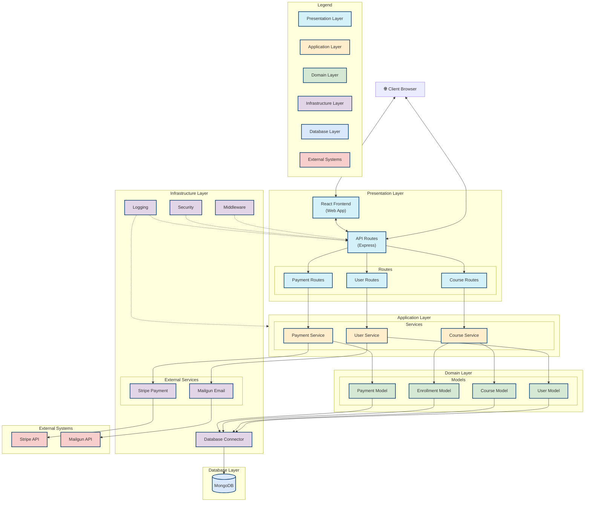

```mermaid
graph TB
    classDef presentation fill:#d4f1f9,stroke:#05386B,stroke-width:2px
    classDef application fill:#ffedcc,stroke:#05386B,stroke-width:2px
    classDef domain fill:#D5E8D4,stroke:#05386B,stroke-width:2px
    classDef infrastructure fill:#E1D5E7,stroke:#05386B,stroke-width:2px
    classDef database fill:#DAE8FC,stroke:#05386B,stroke-width:2px
    classDef external fill:#F8CECC,stroke:#05386B,stroke-width:2px

    %% Main Components
    Client["🌐 Client Browser"]
    
    subgraph PresentationLayer["Presentation Layer"]
        WebApp["React Frontend<br>(Web App)"]
        ApiRoutes["API Routes<br>(Express)"]
        subgraph Routes
            UserRoutes["User Routes"]
            CourseRoutes["Course Routes"]
            PaymentRoutes["Payment Routes"]
        end
    end
    
    subgraph ApplicationLayer["Application Layer"]
        subgraph Services
            UserService["User Service"]
            CourseService["Course Service"]  
            PaymentService["Payment Service"]
        end
    end
    
    subgraph DomainLayer["Domain Layer"]
        subgraph Models
            UserModel["User Model"]
            CourseModel["Course Model"]
            EnrollmentModel["Enrollment Model"]
            PaymentModel["Payment Model"]
        end
    end
    
    subgraph InfrastructureLayer["Infrastructure Layer"]
        Security["Security"]
        Logging["Logging"]
        Middleware["Middleware"]
        Database["Database Connector"]
        
        subgraph ExternalServices["External Services"]
            StripeService["Stripe Payment"]
            EmailService["Mailgun Email"]
        end
    end
    
    subgraph DatabaseLayer["Database Layer"]
        MongoDB[(MongoDB)]
    end
    
    subgraph ExternalSystemsLayer["External Systems"]
        StripeAPI["Stripe API"]
        MailgunAPI["Mailgun API"]
    end
    
    %% Connections
    Client <--> WebApp
    Client <--> ApiRoutes
    
    WebApp <--> ApiRoutes
    
    ApiRoutes --> UserRoutes
    ApiRoutes --> CourseRoutes
    ApiRoutes --> PaymentRoutes
    
    UserRoutes --> UserService
    CourseRoutes --> CourseService
    PaymentRoutes --> PaymentService
    
    UserService --> UserModel
    CourseService --> CourseModel
    CourseService --> EnrollmentModel
    PaymentService --> PaymentModel
    
    UserModel --> Database
    CourseModel --> Database
    EnrollmentModel --> Database
    PaymentModel --> Database
    
    Database --> MongoDB
    
    PaymentService --> StripeService
    UserService --> EmailService
    
    StripeService --> StripeAPI
    EmailService --> MailgunAPI
    
    %% Middleware and Cross-Cutting Concerns
    Middleware -.-> ApiRoutes
    Security -.-> ApiRoutes
    Logging -.-> ApiRoutes
    Logging -.-> ApplicationLayer
    
    %% Apply classes
    class WebApp,ApiRoutes,UserRoutes,CourseRoutes,PaymentRoutes presentation
    class UserService,CourseService,PaymentService application
    class UserModel,CourseModel,EnrollmentModel,PaymentModel domain
    class Security,Logging,Middleware,Database,StripeService,EmailService infrastructure
    class MongoDB database
    class StripeAPI,MailgunAPI external
    
    %% Legend
    subgraph Legend
        Presentation["Presentation Layer"]
        Application["Application Layer"]
        Domain["Domain Layer"]
        Infrastructure["Infrastructure Layer"]
        DB["Database Layer"]
        External["External Systems"]
    end
    
    class Presentation presentation
    class Application application
    class Domain domain
    class Infrastructure infrastructure
    class DB database
    class External external
``` 