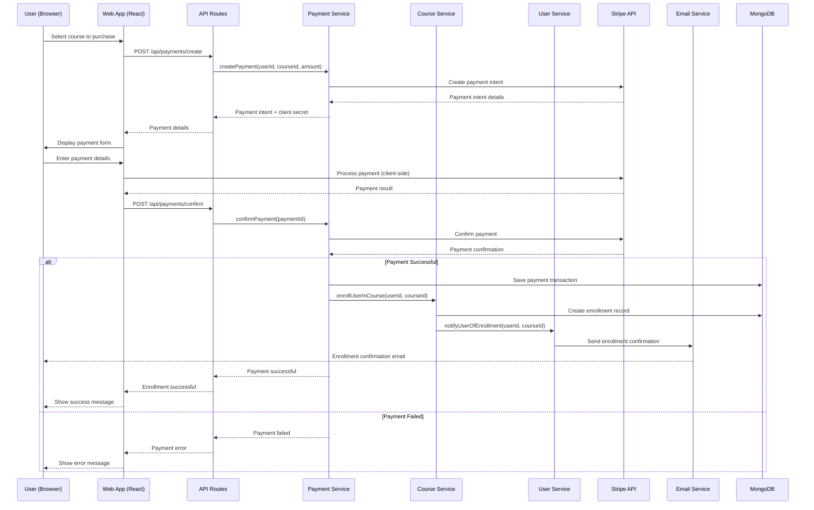

```mermaid
sequenceDiagram
    participant User as User (Browser)
    participant Web as Web App (React)
    participant API as API Routes
    participant PS as Payment Service
    participant CS as Course Service
    participant US as User Service
    participant Stripe as Stripe API
    participant Email as Email Service
    participant DB as MongoDB

    User->>Web: Select course to purchase
    Web->>API: POST /api/payments/create
    API->>PS: createPayment(userId, courseId, amount)
    PS->>Stripe: Create payment intent
    Stripe-->>PS: Payment intent details
    PS-->>API: Payment intent + client secret
    API-->>Web: Payment details
    Web->>User: Display payment form
    
    User->>Web: Enter payment details
    Web->>Stripe: Process payment (client-side)
    Stripe-->>Web: Payment result
    Web->>API: POST /api/payments/confirm
    API->>PS: confirmPayment(paymentId)
    PS->>Stripe: Confirm payment
    Stripe-->>PS: Payment confirmation
    
    alt Payment Successful
        PS->>DB: Save payment transaction
        PS->>CS: enrollUserInCourse(userId, courseId)
        CS->>DB: Create enrollment record
        CS->>US: notifyUserOfEnrollment(userId, courseId)
        US->>Email: Send enrollment confirmation
        Email-->>User: Enrollment confirmation email
        PS-->>API: Payment successful
        API-->>Web: Enrollment successful
        Web-->>User: Show success message
    else Payment Failed
        PS-->>API: Payment failed
        API-->>Web: Payment error
        Web-->>User: Show error message
    end
``` 