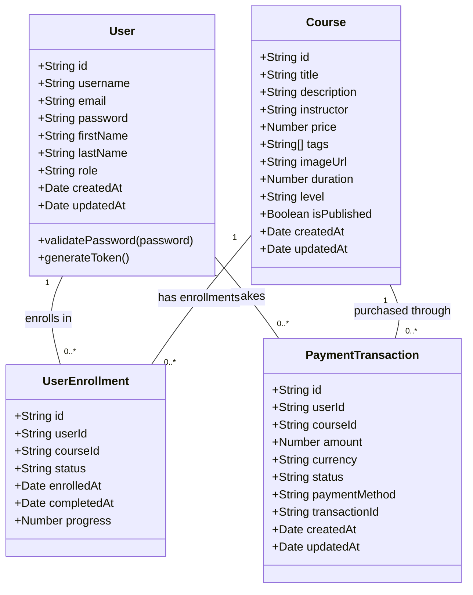

```mermaid
classDiagram
    class User {
        +String id
        +String username
        +String email
        +String password
        +String firstName
        +String lastName
        +String role
        +Date createdAt
        +Date updatedAt
        +validatePassword(password)
        +generateToken()
    }
    
    class Course {
        +String id
        +String title
        +String description
        +String instructor
        +Number price
        +String[] tags
        +String imageUrl
        +Number duration
        +String level
        +Boolean isPublished
        +Date createdAt
        +Date updatedAt
    }
    
    class UserEnrollment {
        +String id
        +String userId
        +String courseId
        +String status
        +Date enrolledAt
        +Date completedAt
        +Number progress
    }
    
    class PaymentTransaction {
        +String id
        +String userId
        +String courseId
        +Number amount
        +String currency
        +String status
        +String paymentMethod
        +String transactionId
        +Date createdAt
        +Date updatedAt
    }
    
    User "1" -- "0..*" UserEnrollment : enrolls in
    User "1" -- "0..*" PaymentTransaction : makes
    Course "1" -- "0..*" UserEnrollment : has enrollments
    Course "1" -- "0..*" PaymentTransaction : purchased through
``` 